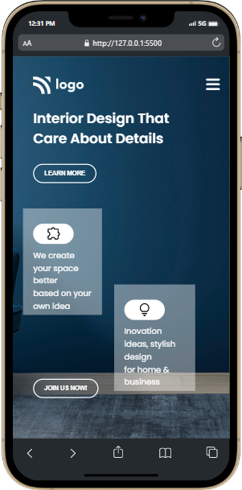
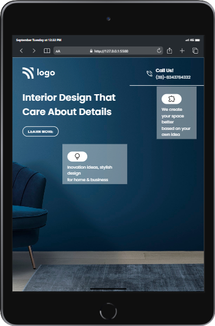
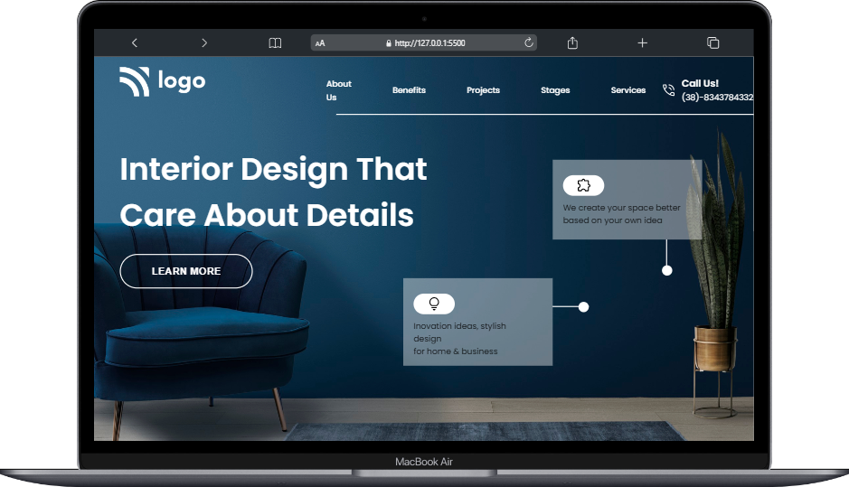
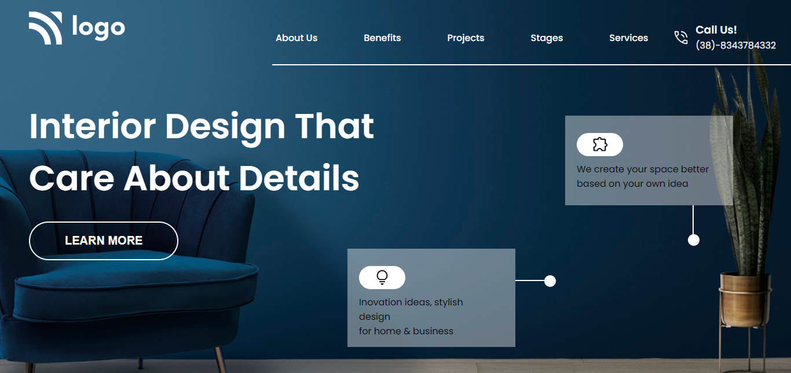

# Interior Design Landing Page

***
## Description

This project [Interior Design Landing Page]() was built using Semantic HTML and CSS. The main aim was to make the webpage responsive for all major devices. While building this project I learnt about **pseudo classes** mainly :first-child and :last-child and also about flexbox properties and handling child of same divs on the webpage. The Project was completed under guidance of [Hitesh Choudhary](https://github.com/hiteshchoudhary), CTO Ineuron

***

### Links for Project

* [LIVE Project Link]()

* [Youtube Video Demo]()

* [Source Code]()

***
### Built With 

* Semantic HTML
* Custom CSS classes
* Pseudo Classes & Elements
* FlexBox
* Positions
* Media Queries

***

### Key Learnings

* Learned about [pseudo classes](https://developer.mozilla.org/en-US/docs/Web/CSS/Pseudo-classes)(:first-child and :last-child)
* Learned using [flexbox](https://developer.mozilla.org/en-US/docs/Web/CSS/flex)
* Learned to use positions(absolute & relative) for positioning same divs on webpage.
* Learned to handle background-image with its properties.
* Learned to make webpage responsive with the help of [media queries](https://developer.mozilla.org/en-US/docs/Web/CSS/Media_Queries/Using_media_queries)

***

### Time Taken to finish this project
 

>1 hour to build it from scratch

>2 hours to make it responsive

 

***

### Screencaptures of Project

 

  1. #### Mobile View

 

 

  2. #### Tablet View 

   

  

   

  3. #### Large Screen View 

   

  

   

  4. #### Whole Webpage(Large Screens)

   

  

   

***

### Checkout Portfolio & Other Projects

#### [Personal Portfolio]()

#### [Findcoder Profile]()
***

### Connect with Me
* [Mailto](mailto:shubhambhoj3@gmail.com)
* [LinkedIn]()
* [Github]()
* [Findcoder]()
***
***
[go to top](#interior-design-landing-page)